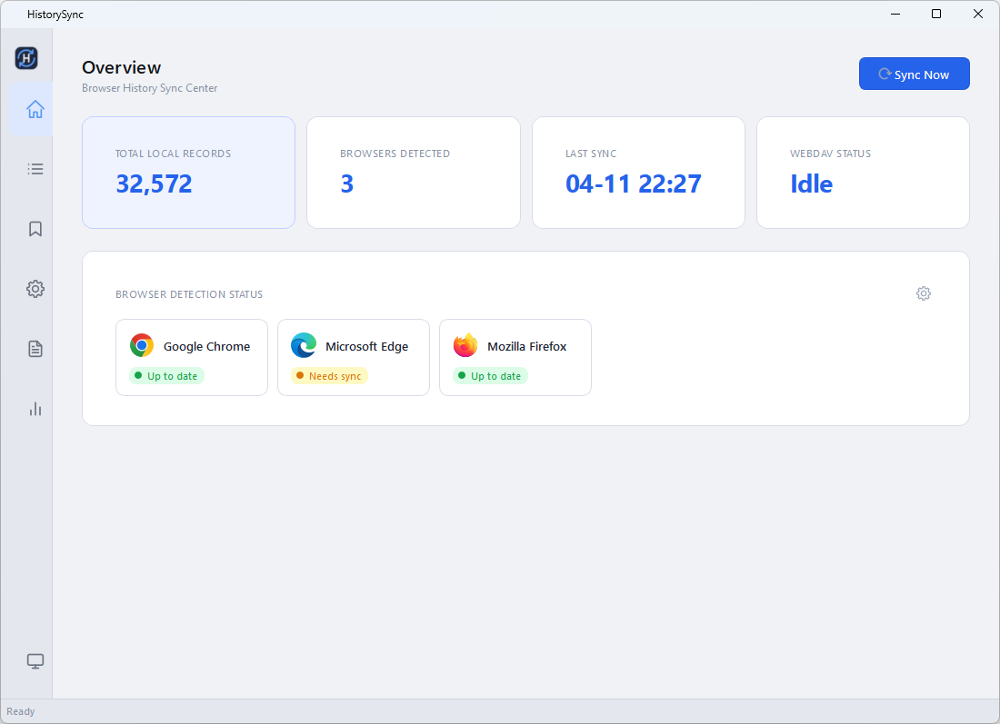
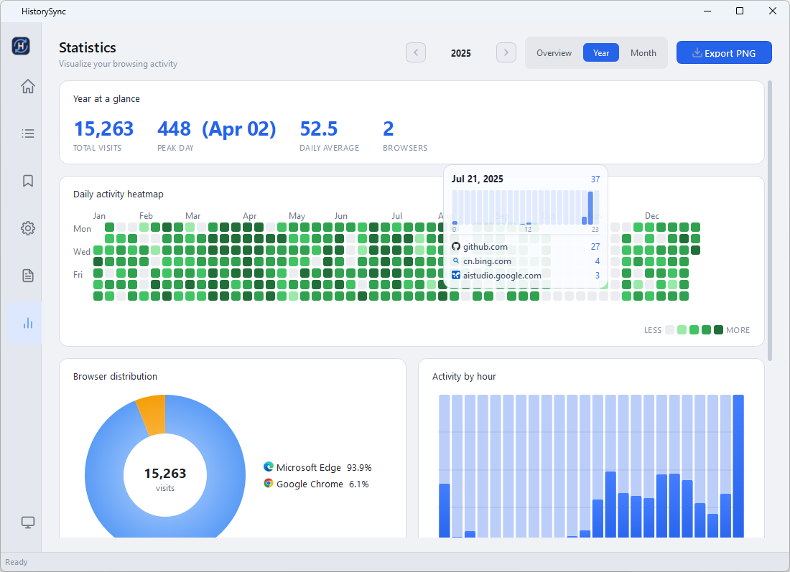
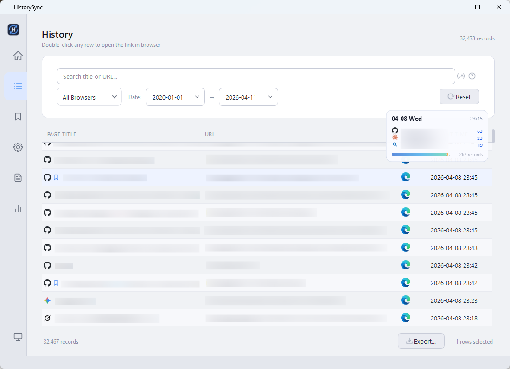

<div align="center">


</div>
<p align="center">
  English | 
  <a href="./docs/README.zh-CN.md">简体中文</a> | 
  <a href="./docs/README.zh-TW.md">繁體中文</a> | 
  <a href="./docs/README.ja.md">日本語</a> | 
  <a href="./docs/README.ko.md">한국어</a> | 
  <a href="./docs/README.ru.md">Русский</a> | 
  <a href="./docs/README.fr.md">Français</a>
<br></p>

# HistorySync
**HistorySync** is a powerful, cross-platform desktop application. It provides a complete and efficient solution for unified browser history management and cloud backup. From multi-browser data aggregation and millisecond full-text search to automated WebDAV backups and rich statistics, it gives you complete ownership over your browsing data.

It natively supports the underlying databases of Chromium-based, Firefox-based, and Safari browsers, offering exceptional privacy protection and a seamless local management experience.

---

## 📥 Download
You can download the latest versions from the **[GitHub Releases](https://github.com/TheSkyC/HistorySync/releases/latest)** page.

[](https://github.com/TheSkyC/HistorySync/releases/latest)

## 🚀 Core Features

### 📂 Omnipotent Data Aggregation (Supports 30+ Browsers)
*   **Massive Browser Compatibility**: Natively supports Chrome, Edge, Firefox, Safari, Brave, Vivaldi, Arc, and numerous regional/custom browsers (QQ, Sogou, CentBrowser, etc.).
*   **Smart Incremental Extraction**: Safely reads SQLite WAL snapshots, allowing lossless, conflict-free extraction even while your browsers are running.
*   **Portable DB Import**: Manually import standalone `History` or `places.sqlite` files to easily merge data from old computers or portable browsers.

### 🔍 Spotlight-style Quick Search & Knowledge Base
*   **Quick Access Overlay**: Press `Ctrl+Shift+H` anywhere to summon a minimalist search overlay. Instantly retrieve history and open URLs.
*   **New Keybinding Engine**: A cross-platform hotkey system based on `pynput`, offering 14 highly customizable global and in-app shortcuts.
*   **Advanced Query DSL**: Search like a pro using tokens (e.g., `domain:github.com`, `after:2024-01-01`). Features fuzzy-matching dropdowns and ghost-text inline completion.
*   **Bookmarks & Annotations**: Turn your history into a knowledge base. Add tags and rich-text notes to important pages.

### ⚡ Extreme Performance & Modern UI
*   **Silky Smooth Scrolling on Millions of Records**: Rewritten pagination logic introduces two-step pagination and Keyset indexes. Regex searches are pushed down to the SQL layer, completely eliminating stuttering on massive datasets.
*   **Adaptive Interface**: Proportional column-width distribution ensures smooth window resizing. Seamlessly supports real-time switching between system Dark/Light themes.
*   **Rich Data Visualization**: Understand your digital footprint through a GitHub-style daily heatmap, browser market-share pie charts, and 24-hour activity bars. Export as high-res images with one click.

### ☁️ Cloud Sync & Automation
*   **WebDAV Backup & Merge**: Utilizes **atomic streamed uploads**. When restoring from the cloud, the system intelligently merges records across multiple devices.
*   **Headless CLI (`hsync`)**: A fully-featured command-line tool for power users. Automate extractions, backups, and exports in headless environments with extremely low memory footprint.
*   **Silent Background Mode**: Runs minimized in the system tray, performing scheduled extractions and backups automatically.

### 🛡️ Ultimate Privacy & Control
*   **Hidden Mode & Soft Hiding**: A dedicated "Hidden Records" view. Supports soft-hiding specific domains (records remain in the database but disappear from the main view).
*   **Security Architecture V2**: Protects sensitive configurations like WebDAV credentials using independent HKDF encryption and authentication subkeys.
*   **Domain Blacklist & URL Filters**: One-click ban specific domains. They are instantly deleted and permanently ignored in future syncs.

## 📸 Screenshots

*Data Dashboard Overview*



<details>
<summary><b>► Click to view more screenshots</b></summary>

*Visual Statistics & Heatmap*



*History Search & Management*



</details>

## 🛠️ Development Setup

### Prerequisites
*   Python 3.10 or higher
*   Git (optional, for cloning the repository)

### Steps
1.  **Clone the repository (or download ZIP)**
    ```bash
    git clone https://github.com/TheSkyC/HistorySync.git
    cd HistorySync
    ```

2.  **Create and activate a virtual environment (Recommended)**
    ```bash
    python -m venv venv
    # Windows
    .\venv\Scripts\activate
    # macOS/Linux
    source venv/bin/activate
    ```

3.  **Install dependencies**
    ```bash
    pip install -r requirements.txt
    ```

4.  **Run the application**
    ```bash
    python -m src.main
    ```

## 🚀 Quick Start

HistorySync offers flexible working modes. You can use it as a background service or an active management tool:

### 1. 🔄 Silent Background Mode (Recommended)
*Ideal for users who want to "set it and forget it" for automated backups.*
1.  **Startup**: Go to `Settings > Startup Settings` and enable "Launch at system startup".
2.  **Schedule**: Set your extraction interval under `Auto Sync`.
3.  **Cloud**: Enter your WebDAV credentials in `WebDAV Cloud Backup` and enable auto-backup.
4.  **Run**: Close the main window. The app will minimize to the tray and quietly protect your data.

### 2. 🔍 Active Management Mode
*Ideal for users who frequently search history, annotate pages, or clear privacy data.*
1.  **Quick Search**: Press `Ctrl+Shift+H` anywhere to summon the search overlay.
2.  **Knowledge Base**: Bookmark important pages and add notes for future reference.
3.  **Privacy**: Select unwanted records and delete them, or choose "Blacklist Domain" to wipe a site's traces permanently.

## 🌐 Supported Languages
This tool supports the following UI languages:
*   **English** (`en_US`)
*   **简体中文** (`zh_CN`)
*   **繁體中文** (`zh_TW`)
*   **日本語** (`ja_JP`)
*   **한국어** (`ko_KR`)
*   **Français** (`fr_FR`)
*   **Deutsch** (`de_DE`)
*   **Русский** (`ru_RU`)
*   **Español** (`es_ES`)
*   **Italiano** (`it_IT`)

## 🤝 Contributing
Contributions of any kind are welcome! If you have any questions, feature suggestions, or find a bug, please feel free to submit them via GitHub Issues.

## 📄 License
This project is open-sourced under the [Apache 2.0](LICENSE) license, allowing free use, modification, and distribution, provided the copyright notice is retained.

## 📞 Contact
- Author: TheSkyC
- Email: 0x4fe6@gmail.com