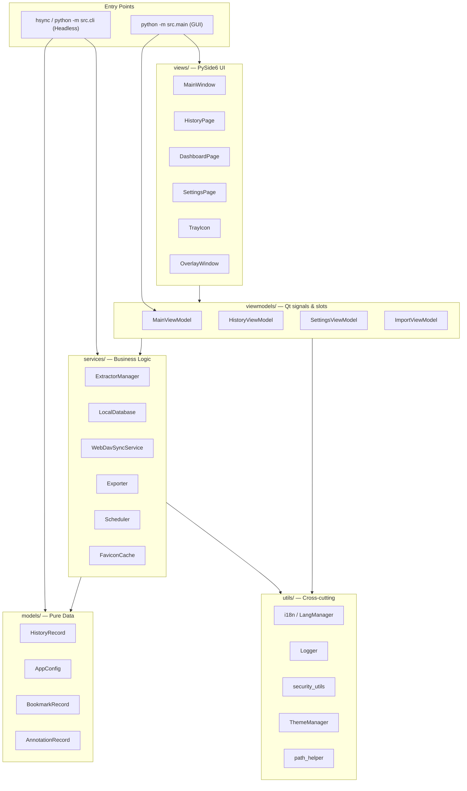
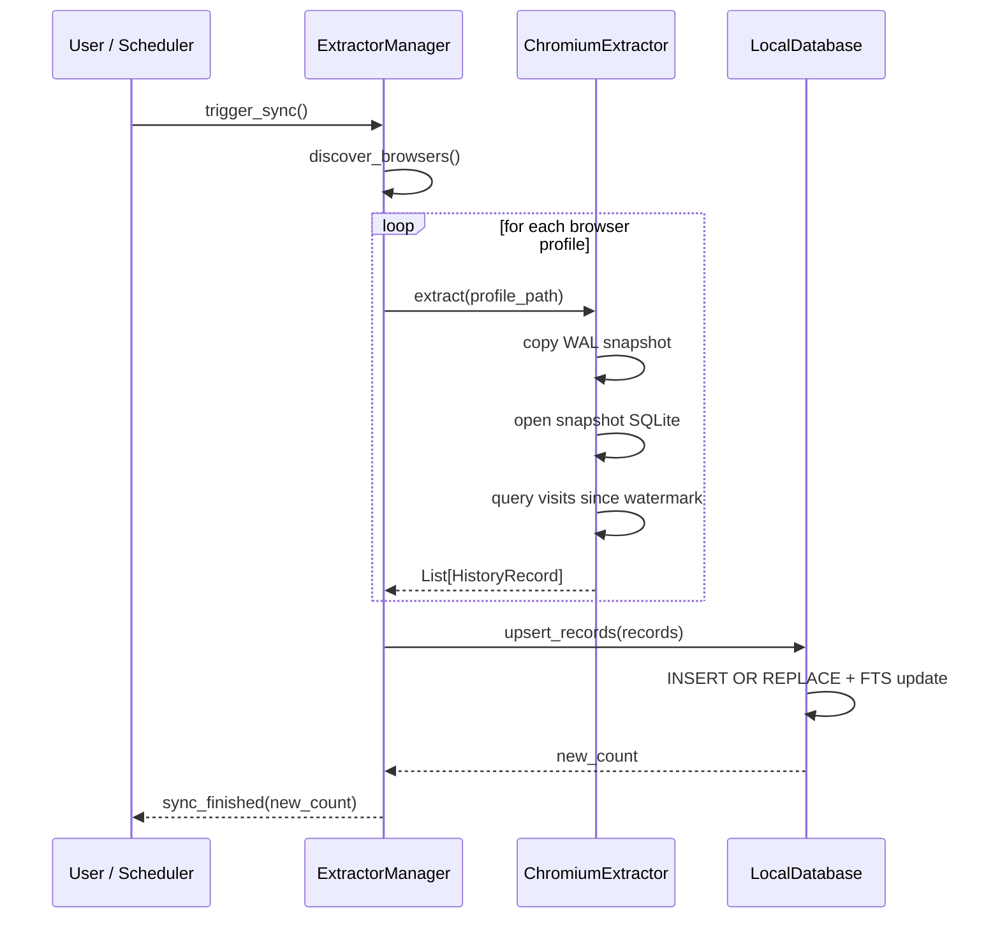

# Architecture Overview

HistorySync follows a clean **MVVM (Model-View-ViewModel)** architecture. GUI code is strictly separated from business logic, making it possible to run the full feature set headlessly via the CLI.

---

## High-Level Diagram



---

## Directory Layout

```
src/
├── __init__.py
├── main.py              # GUI entry point & CLI argument parsing
├── cli.py               # Headless CLI (hsync) entry point
│
├── models/              # Pure data structures (no business logic)
│   ├── app_config.py    # AppConfig dataclass + all sub-configs
│   └── history_record.py# HistoryRecord, BookmarkRecord, AnnotationRecord, BackupStats
│
├── services/            # Business logic (no Qt imports)
│   ├── local_db.py      # SQLite database — schema, queries, FTS
│   ├── extractor_manager.py  # Discovers and orchestrates browser extractors
│   ├── extractors/      # Per-browser extractor implementations
│   │   ├── base_extractor.py      # Abstract extractor base class
│   │   ├── chromium_extractor.py  # Handles Chromium-based browsers
│   │   ├── firefox_extractor.py   # Handles Firefox-based browsers
│   │   ├── safari_extractor.py    # Safari history extraction
│   │   └── favicon_extractor.py   # Per-browser favicon extraction helpers
│   ├── webdav_sync.py    # WebDAV backup/restore logic
│   ├── exporter.py      # CSV / JSON / HTML export
│   ├── favicon_cache.py # Favicon storage and retrieval
│   ├── favicon_manager.py# Async favicon refresh pipeline
│   ├── scheduler.py     # Background sync/backup scheduler
│   ├── hotkey_manager.py# pynput global hotkey registration
│   ├── mock_data_generator.py # Stress-test data generator
│   ├── migration_service.py  # Legacy installation migration flow
│   ├── browser_monitor.py    # Browser sync status tracking
│   ├── browser_scanner.py    # Detect portable/unknown browsers
│   └── db_importer.py        # Import external database files
│
├── viewmodels/          # Qt ViewModel layer — signals, slots, state
│   ├── main_viewmodel.py
│   ├── history_viewmodel.py
│   ├── settings_viewmodel.py
│   └── import_viewmodel.py
│
├── views/               # PySide6 UI components
│   ├── main_window.py
│   ├── history_page.py
│   ├── dashboard_page.py
│   ├── stats_page.py
│   ├── bookmarks_page.py
│   ├── overlay_window.py
│   ├── settings_page.py
│   ├── tray_icon.py
│   ├── export_dialog.py
│   ├── import_dialog.py
│   └── migration_wizard.py
│
├── utils/               # Cross-cutting utilities
│   ├── constants.py     # APP_NAME, APP_VERSION, defaults, keybinding names
│   ├── i18n.py          # Qt-aware language bridge
│   ├── i18n_core.py     # Headless-safe gettext helpers
│   ├── logger.py        # Logging setup
│   ├── security_utils.py# HKDF key derivation, encryption/decryption
│   ├── theme_manager.py # Dark/light/system theme application
│   ├── font_manager.py  # Custom font application
│   ├── path_helper.py   # Platform config/data/log directory resolution
│   ├── single_instance.py # Single-instance server (QTcpServer)
│   ├── search_parser.py # Structured search query parsing
│   ├── search_highlighter.py # GUI query highlighting
│   └── migration_detector.py
│
└── resources/
    ├── icons/           # SVG/PNG icons and browser logos
    └── locales/         # gettext .po/.mo translation files
    └── ...
```

---

## Key Components

### `AppConfig` (models/app_config.py)

A large **dataclass** that holds all user settings. Nested sub-configs (`WebDavConfig`, `SchedulerConfig`, `ExtractorConfig`, etc.) map directly to JSON. `AppConfig.load()` / `.save()` handle atomic JSON serialisation with automatic backup on corruption.

Notable design choices:
- **Runtime flags** (`_fresh`, `_load_error`) use `field(init=False)` and are never persisted.
- WebDAV passwords are **encrypted on save** and **decrypted on load** via `security_utils`.
- In `--fresh` mode the config always uses a temporary directory; no disk reads or writes occur.

---

### `LocalDatabase` (services/local_db.py)

Wraps a SQLite database with:
- **FTS5** full-text search on `title` and `url`.
- **Keyset pagination** for O(1) page navigation on multi-million-row tables.
- **Upsert logic** for incremental sync — records are identified by `(browser_type, url, visit_time)`.
- Lazy connection — the database file is not opened until the first query.

---

### `ExtractorManager` + Extractors (services/extractors/)

`ExtractorManager` auto-discovers browser installations, then delegates to the correct extractor:

- **`ChromiumExtractor`** — handles all Chromium forks. Uses WAL snapshot copy to read the locked `History` SQLite file without conflicting with a running browser.
- **`FirefoxExtractor`** — reads `places.sqlite` using the same WAL snapshot technique.
- **`SafariExtractor`** — reads Safari's binary history database on macOS.

Adding a new browser is usually as simple as subclassing `ChromiumExtractor` and setting the data directory path.

---

### Scheduler (services/scheduler.py)

A lightweight background thread that fires sync and backup events on a configurable interval. Uses `threading.Event` for clean shutdown — no external task-queue dependency.

---

### ViewModels (viewmodels/*.py)

The current ViewModel layer is intentionally small and concrete:

- **`MainViewModel`** coordinates sync, backup, scheduler, overlay, tray, and database lifecycle.
- **`HistoryViewModel`** manages search state, paging, and virtualised history list loading.
- **`SettingsViewModel`** exposes settings persistence and maintenance actions to the settings UI.
- **`ImportViewModel`** drives external database import workflows.

This is narrower than a textbook MVVM split, but it matches the current codebase more accurately than documenting non-existent per-page ViewModels.

---

### Security (utils/security_utils.py)

See the full [Security Architecture](security.md) page for details. In short:
- A random master key is stored in the **OS keychain** via `keyring`.
- HKDF derives **independent encryption and MAC subkeys**.
- HKDF-SHA256 keystream XOR with HMAC-SHA256 is used for authenticated encryption of sensitive config values.

---

### i18n (utils/i18n.py / utils/i18n_core.py)

The project splits localisation into two layers:

- **`i18n_core.py`** contains the headless-safe gettext helpers used by services, models, and CLI code.
- **`i18n.py`** re-exports that API and adds the Qt bridge used by UI code.

Translations live in `src/resources/locales/` as `.po` / `.mo` files. Language is auto-detected from the OS locale if `AppConfig.language` is empty.

---

## Data Flow: Browser Sync



---

## Threading Model

| Thread | Responsibility |
|---|---|
| **Qt main thread** | UI rendering, signal dispatch |
| **Scheduler thread** | Periodic sync/backup triggers |
| **Worker threads** | Extractor I/O, WebDAV uploads (Qt `QThreadPool`) |
| **pynput thread** | Global hotkey listener |
| **Favicon thread** | Async favicon download and caching |

All cross-thread communication uses Qt signals/slots — background threads emit signals; the main thread processes them.

---

## Design Principles

1. **Services have zero Qt dependency** — they can be used from the headless CLI without a `QApplication`.
2. **Atomic file operations** — config saves and WebDAV uploads use temp-file-then-rename to prevent partial writes.
3. **Privacy by default** — `chrome://`, `about:`, `file://`, and browser extension URLs are filtered out automatically.
4. **Graceful degradation** — a corrupt config is backed up and replaced with defaults; the app continues to run.
