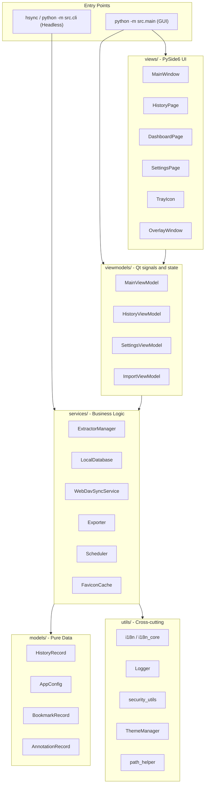

# Aperçu de l'Architecture

HistorySync suit une architecture **MVVM (Modèle-Vue-ViewModel)** claire. Le code UI et la logique métier restent séparés, ce qui permet d'utiliser les mêmes briques dans l'application de bureau et dans la CLI sans interface.

---

## Diagramme de Haut Niveau



---

## Arborescence des Répertoires

```
src/
├── main.py
├── cli.py
├── models/
│   ├── app_config.py
│   └── history_record.py
├── services/
│   ├── local_db.py
│   ├── extractor_manager.py
│   ├── webdav_sync.py
│   ├── exporter.py
│   ├── scheduler.py
│   ├── favicon_cache.py
│   ├── favicon_manager.py
│   ├── browser_monitor.py
│   ├── browser_scanner.py
│   ├── db_importer.py
│   ├── migration_service.py
│   ├── mock_data_generator.py
│   └── extractors/
│       ├── base_extractor.py
│       ├── chromium_extractor.py
│       ├── firefox_extractor.py
│       ├── safari_extractor.py
│       └── favicon_extractor.py
├── viewmodels/
│   ├── main_viewmodel.py
│   ├── history_viewmodel.py
│   ├── settings_viewmodel.py
│   └── import_viewmodel.py
├── views/
│   ├── main_window.py
│   ├── history_page.py
│   ├── dashboard_page.py
│   ├── stats_page.py
│   ├── bookmarks_page.py
│   ├── settings_page.py
│   ├── overlay_window.py
│   ├── tray_icon.py
│   ├── export_dialog.py
│   └── import_dialog.py
└── utils/
    ├── constants.py
    ├── i18n.py
    ├── i18n_core.py
    ├── logger.py
    ├── path_helper.py
    ├── security_utils.py
    ├── search_parser.py
    ├── search_highlighter.py
    ├── single_instance.py
    ├── theme_manager.py
    └── font_manager.py
```

Cette vue liste volontairement seulement les modules structurants, afin d'éviter de figer dans la documentation des détails secondaires qui changent souvent.

---

## Composants Clés

### AppConfig

`src/models/app_config.py` contient l'ensemble de la configuration utilisateur. Les sous-configurations imbriquées sont sérialisées en JSON, avec sauvegarde de secours si le fichier est corrompu.

Points importants :
- les champs d'exécution comme `_fresh` et `_load_error` ne sont pas persistés ;
- les mots de passe WebDAV sont chiffrés à l'écriture puis déchiffrés au chargement ;
- le mode `--fresh` force un répertoire temporaire et n'utilise pas les vraies données utilisateur.

### LocalDatabase

`src/services/local_db.py` encapsule SQLite et gère :
- la recherche plein texte FTS5 ;
- la pagination et les requêtes sur de gros volumes ;
- l'upsert/déduplication par `(browser_type, url, visit_time)` ;
- les signets, annotations, enregistrements masqués et données d'appareil.

### ExtractorManager et extracteurs

`src/services/extractor_manager.py` orchestre la découverte des navigateurs et l'extraction. Les implémentations concrètes vivent dans `src/services/extractors/`.

Points importants :
- les extracteurs Chromium et Firefox lisent les bases ouvertes via des copies de snapshot WAL ;
- l'extracteur Safari couvre le format spécifique à macOS ;
- l'ajout d'un nouveau navigateur de la même famille passe souvent par l'extension d'un extracteur existant.

### Couche ViewModel

La couche ViewModel actuelle reste compacte et correspond au code réel :
- `MainViewModel` coordonne la synchronisation, la sauvegarde, le scheduler, le tray et l'overlay ;
- `HistoryViewModel` gère l'état de recherche, la pagination et le chargement virtualisé ;
- `SettingsViewModel` expose la persistance de configuration et les actions de maintenance ;
- `ImportViewModel` pilote les imports de bases externes.

### Découpage i18n

La localisation est séparée en deux niveaux :
- `src/utils/i18n_core.py` pour la CLI, les services et les modèles ;
- `src/utils/i18n.py` pour le pont Qt côté UI.

Ce découpage garde le mode headless indépendant de Qt tout en laissant l'interface réagir aux changements de langue.

---

## Modèle de Threading

| Thread | Responsabilité |
|---|---|
| Thread principal Qt | rendu UI et dispatch des signaux |
| Thread du scheduler | déclencheurs périodiques sync/backup |
| Threads de travail | I/O des extracteurs, uploads WebDAV, maintenance |
| Thread pynput | écoute des raccourcis globaux |
| Thread favicon | téléchargement et cache des favicons |

La communication inter-threads passe principalement par les signaux/slots Qt.

---

## Principes de Conception

1. **Pas de dépendance Qt dans les services**, afin de réutiliser la logique en GUI et en CLI.
2. **Opérations de fichiers atomiques**, pour éviter les écritures partielles de configuration et de sauvegarde.
3. **Confidentialité par défaut**, avec filtrage des URLs internes et des domaines bloqués.
4. **Dégradation gracieuse**, pour continuer à fonctionner même en cas de config corrompue ou de sauvegarde distante échouée.
```

---

## Modèle de Threading

| Thread | Responsabilité |
|---|---|
| **Thread principal Qt** | Rendu de l'interface, dispatch des signaux |
| **Thread du planificateur** | Déclencheurs périodiques de synchronisation/sauvegarde |
| **Threads de travail** | E/S des extracteurs, téléversements WebDAV (Qt `QThreadPool`) |
| **Thread pynput** | Écouteur de raccourcis globaux |
| **Thread de favicons** | Téléchargement asynchrone et mise en cache des favicons |

Toute communication inter-threads utilise les signaux/slots Qt — les threads d'arrière-plan émettent des signaux ; le thread principal les traite.

---

## Principes de Conception

1. **Les services n'ont aucune dépendance Qt** — ils peuvent être utilisés depuis la CLI sans interface graphique sans `QApplication`.
2. **Opérations de fichiers atomiques** — les sauvegardes de configuration et les téléversements WebDAV utilisent le pattern temp-file-then-rename pour éviter les écritures partielles.
3. **Confidentialité par défaut** — les URLs `chrome://`, `about:`, `file://` et les extensions de navigateur sont filtrées automatiquement.
4. **Dégradation gracieuse** — une configuration corrompue est sauvegardée et remplacée par des valeurs par défaut ; l'application continue de fonctionner.
