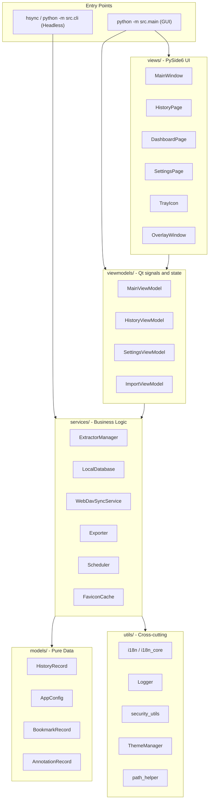

# アーキテクチャ概要

HistorySync は **MVVM（Model-View-ViewModel）** をベースにした構成を採用しています。UI と業務ロジックを分離することで、同じ中核機能を GUI とヘッドレス CLI の両方から使えるようにしています。

---

## 高レベルダイアグラム



---

## ディレクトリ構造

```
src/
├── main.py
├── cli.py
├── models/
│   ├── app_config.py
│   └── history_record.py
├── services/
│   ├── local_db.py
│   ├── extractor_manager.py
│   ├── webdav_sync.py
│   ├── exporter.py
│   ├── scheduler.py
│   ├── favicon_cache.py
│   ├── favicon_manager.py
│   ├── browser_monitor.py
│   ├── browser_scanner.py
│   ├── db_importer.py
│   ├── migration_service.py
│   ├── mock_data_generator.py
│   └── extractors/
│       ├── base_extractor.py
│       ├── chromium_extractor.py
│       ├── firefox_extractor.py
│       ├── safari_extractor.py
│       └── favicon_extractor.py
├── viewmodels/
│   ├── main_viewmodel.py
│   ├── history_viewmodel.py
│   ├── settings_viewmodel.py
│   └── import_viewmodel.py
├── views/
│   ├── main_window.py
│   ├── history_page.py
│   ├── dashboard_page.py
│   ├── stats_page.py
│   ├── bookmarks_page.py
│   ├── settings_page.py
│   ├── overlay_window.py
│   ├── tray_icon.py
│   ├── export_dialog.py
│   └── import_dialog.py
└── utils/
    ├── constants.py
    ├── i18n.py
    ├── i18n_core.py
    ├── logger.py
    ├── path_helper.py
    ├── security_utils.py
    ├── search_parser.py
    ├── search_highlighter.py
    ├── single_instance.py
    ├── theme_manager.py
    └── font_manager.py
```

この一覧は、実際のコードにある主要モジュールだけを挙げています。頻繁に変わる補助ファイルまで固定化しないためです。

---

## 主要コンポーネント

### AppConfig

`src/models/app_config.py` は全ユーザー設定を保持します。ネストした設定は JSON に保存され、破損した設定ファイルを読み込んだ場合は自動的にバックアップと復旧が行われます。

重要な点：
- `_fresh` や `_load_error` などの実行時フィールドは永続化されません。
- WebDAV パスワードは保存時に暗号化され、読み込み時に復号されます。
- `--fresh` モードでは一時ディレクトリのみを使い、実データに触れません。

### LocalDatabase

`src/services/local_db.py` は SQLite のラッパーで、以下を扱います。
- FTS5 全文検索
- 大規模データ向けのページングと問い合わせ
- `(browser_type, url, visit_time)` をキーにした upsert / 重複排除
- ブックマーク、注釈、隠しレコード、デバイス情報などの追加ストレージ

### ExtractorManager と各 extractor

`src/services/extractor_manager.py` がブラウザ検出と抽出フロー全体を調整します。具体的な抽出ロジックは `src/services/extractors/` 配下にあります。

重要な点：
- Chromium 系と Firefox 系は WAL スナップショットで起動中ブラウザの DB を安全に読みます。
- Safari extractor は macOS 固有の履歴形式を扱います。
- 同系統ブラウザの追加は、既存 extractor の拡張で済むことが多いです。

### ViewModel 層

現在の ViewModel 層は小さく、実装に直接対応しています。
- `MainViewModel` は同期、バックアップ、スケジューラー、トレイ、オーバーレイを統括します。
- `HistoryViewModel` は検索状態、ページング、仮想化リストを管理します。
- `SettingsViewModel` は設定保存とメンテナンス操作を UI に公開します。
- `ImportViewModel` は外部 DB インポートを担当します。

### i18n の分割

ローカライズは 2 層に分かれています。
- `src/utils/i18n_core.py` は CLI・services・models 向けです。
- `src/utils/i18n.py` は Qt ブリッジを追加した UI 向けです。

この分離により、ヘッドレスモードは Qt に依存せず、GUI は言語切り替えに追従できます。

---

## スレッドモデル

| スレッド | 役割 |
|---|---|
| Qt メインスレッド | UI 描画とシグナル処理 |
| Scheduler スレッド | 定期 sync / backup トリガー |
| Worker スレッド | extractor I/O、WebDAV アップロード、保守処理 |
| pynput スレッド | グローバルホットキー監視 |
| Favicon スレッド | ファビコン取得とキャッシュ |

スレッド間のやり取りは主に Qt の signals / slots で行われます。

---

## 設計原則

1. **services は Qt に依存しない**。GUI と CLI で同じロジックを再利用できます。
2. **ファイル操作は原子的に行う**。設定やバックアップの中途半端な書き込みを避けます。
3. **プライバシーをデフォルトで守る**。内部ブラウザ URL やブラックリスト対象は自動で除外されます。
4. **優雅に劣化する**。設定破損やリモート障害が起きても、できる限り動作を継続します。
```

---

## スレッドモデル

| スレッド | 責務 |
|---|---|
| **Qt メインスレッド** | UI レンダリング、シグナルディスパッチ |
| **スケジューラースレッド** | 定期的な同期・バックアップのトリガー |
| **ワーカースレッド** | エクストラクター I/O、WebDAV アップロード（Qt `QThreadPool`） |
| **pynput スレッド** | グローバルホットキーリスナー |
| **ファビコンスレッド** | 非同期ファビコンのダウンロードとキャッシュ |

すべてのスレッド間通信は Qt のシグナル・スロットを使用します — バックグラウンドスレッドがシグナルを発行し、メインスレッドがそれを処理します。

---

## 設計原則

1. **サービスは Qt に依存しない** — `QApplication` なしにヘッドレス CLI から使用できます。
2. **アトミックなファイル操作** — 設定の保存と WebDAV アップロードは「一時ファイルへの書き込み → リネーム」を使用して部分的な書き込みを防ぎます。
3. **デフォルトでプライバシーを保護** — `chrome://`、`about:`、`file://`、ブラウザ拡張機能の URL は自動的にフィルタリングされます。
4. **グレースフルな劣化** — 破損した設定はバックアップされてデフォルト設定に置き換えられ、アプリは動作し続けます。
