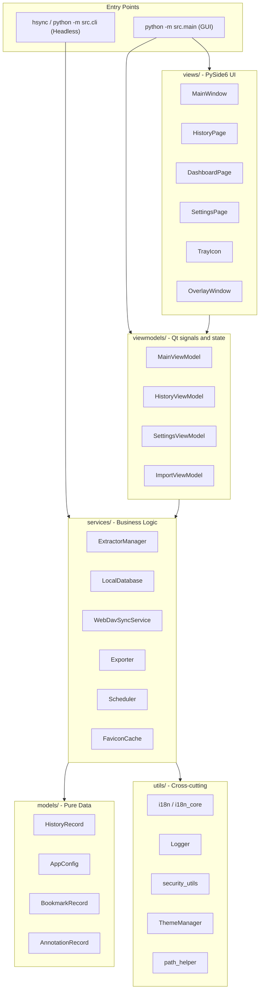

# 아키텍처 개요

HistorySync는 **MVVM (Model-View-ViewModel)** 기반 구조를 사용합니다. UI와 비즈니스 로직을 분리하여, 같은 핵심 기능을 데스크톱 앱과 헤드리스 CLI에서 함께 재사용할 수 있습니다.

---

## 고수준 다이어그램



---

## 디렉토리 구조

```
src/
├── main.py
├── cli.py
├── models/
│   ├── app_config.py
│   └── history_record.py
├── services/
│   ├── local_db.py
│   ├── extractor_manager.py
│   ├── webdav_sync.py
│   ├── exporter.py
│   ├── scheduler.py
│   ├── favicon_cache.py
│   ├── favicon_manager.py
│   ├── browser_monitor.py
│   ├── browser_scanner.py
│   ├── db_importer.py
│   ├── migration_service.py
│   ├── mock_data_generator.py
│   └── extractors/
│       ├── base_extractor.py
│       ├── chromium_extractor.py
│       ├── firefox_extractor.py
│       ├── safari_extractor.py
│       └── favicon_extractor.py
├── viewmodels/
│   ├── main_viewmodel.py
│   ├── history_viewmodel.py
│   ├── settings_viewmodel.py
│   └── import_viewmodel.py
├── views/
│   ├── main_window.py
│   ├── history_page.py
│   ├── dashboard_page.py
│   ├── stats_page.py
│   ├── bookmarks_page.py
│   ├── settings_page.py
│   ├── overlay_window.py
│   ├── tray_icon.py
│   ├── export_dialog.py
│   └── import_dialog.py
└── utils/
    ├── constants.py
    ├── i18n.py
    ├── i18n_core.py
    ├── logger.py
    ├── path_helper.py
    ├── security_utils.py
    ├── search_parser.py
    ├── search_highlighter.py
    ├── single_instance.py
    ├── theme_manager.py
    └── font_manager.py
```

이 목록은 실제 구조를 반영하는 핵심 모듈만 다룹니다. 자주 바뀌는 보조 파일까지 문서에 고정하지 않기 위한 선택입니다.

---

## 핵심 컴포넌트

### AppConfig

`src/models/app_config.py`는 전체 사용자 설정을 담습니다. 중첩 설정은 JSON으로 저장되며, 손상된 설정 파일을 읽을 때는 자동 백업과 복구가 수행됩니다.

핵심 포인트:
- `_fresh`, `_load_error` 같은 런타임 필드는 저장되지 않습니다.
- WebDAV 비밀번호는 저장 시 암호화되고 로드 시 복호화됩니다.
- `--fresh` 모드는 임시 디렉토리만 사용하며 실제 사용자 데이터를 건드리지 않습니다.

### LocalDatabase

`src/services/local_db.py`는 SQLite 래퍼로서 다음을 담당합니다.
- FTS5 전체 텍스트 검색
- 대용량 데이터셋에 대한 페이지네이션과 조회
- `(browser_type, url, visit_time)` 기준 upsert / 중복 제거
- 북마크, 주석, 숨김 기록, 장치 데이터 등 부가 저장소

### ExtractorManager 와 추출기

`src/services/extractor_manager.py`가 브라우저 감지와 추출 흐름 전체를 조율합니다. 실제 추출 로직은 `src/services/extractors/` 아래 구현들에 있습니다.

핵심 포인트:
- Chromium/Firefox 추출기는 WAL 스냅샷으로 실행 중인 브라우저 DB를 안전하게 읽습니다.
- Safari 추출기는 macOS 전용 기록 형식을 처리합니다.
- 같은 계열 브라우저를 추가할 때는 기존 추출기 확장으로 끝나는 경우가 많습니다.

### ViewModel 레이어

현재 ViewModel 레이어는 작고 실제 구현에 직접 대응합니다.
- `MainViewModel`은 동기화, 백업, 스케줄러, 트레이, 오버레이를 조정합니다.
- `HistoryViewModel`은 검색 상태, 페이지네이션, 가상화 리스트를 관리합니다.
- `SettingsViewModel`은 설정 저장과 유지보수 동작을 UI에 노출합니다.
- `ImportViewModel`은 외부 DB 가져오기를 담당합니다.

### i18n 분리

로컬라이제이션은 두 층으로 나뉩니다.
- `src/utils/i18n_core.py`는 CLI, services, models용입니다.
- `src/utils/i18n.py`는 Qt 브리지를 추가한 UI용입니다.

이 분리 덕분에 헤드리스 모드는 Qt에 의존하지 않고, GUI는 언어 변경에 반응할 수 있습니다.

---

## 스레드 모델

| 스레드 | 책임 |
|---|---|
| Qt 메인 스레드 | UI 렌더링 및 시그널 처리 |
| Scheduler 스레드 | 주기적 sync / backup 트리거 |
| Worker 스레드 | 추출기 I/O, WebDAV 업로드, 유지보수 작업 |
| pynput 스레드 | 전역 단축키 감시 |
| Favicon 스레드 | 파비콘 다운로드 및 캐시 |

스레드 간 통신은 주로 Qt signals / slots로 처리됩니다.

---

## 설계 원칙

1. **services는 Qt에 의존하지 않는다**. GUI와 CLI가 같은 핵심 로직을 공유할 수 있습니다.
2. **파일 작업은 원자적으로 수행한다**. 설정과 백업의 반쯤 기록된 상태를 피합니다.
3. **프라이버시를 기본으로 보호한다**. 내부 브라우저 URL과 블랙리스트 도메인은 자동으로 제외됩니다.
4. **우아하게 성능 저하를 허용한다**. 설정 손상이나 원격 백업 실패가 있어도 가능한 한 동작을 계속합니다.
```

---

## 스레딩 모델

| 스레드 | 책임 |
|---|---|
| **Qt 메인 스레드** | UI 렌더링, 시그널 디스패치 |
| **스케줄러 스레드** | 주기적 동기화/백업 트리거 |
| **워커 스레드** | 추출기 I/O, WebDAV 업로드 (Qt `QThreadPool`) |
| **pynput 스레드** | 전역 단축키 리스너 |
| **파비콘 스레드** | 비동기 파비콘 다운로드 및 캐싱 |

모든 크로스 스레드 통신은 Qt 시그널/슬롯을 사용합니다 — 백그라운드 스레드가 시그널을 발생시키면 메인 스레드가 처리합니다.

---

## 설계 원칙

1. **서비스에는 Qt 의존성 없음** — `QApplication` 없이도 헤드리스 CLI에서 사용할 수 있습니다.
2. **원자적 파일 작업** — 설정 저장 및 WebDAV 업로드는 부분 쓰기를 방지하기 위해 임시 파일 후 이름 변경 방식을 사용합니다.
3. **기본적으로 프라이버시 보호** — `chrome://`, `about:`, `file://`, 브라우저 확장 URL은 자동으로 필터링됩니다.
4. **우아한 성능 저하** — 손상된 설정은 백업되고 기본값으로 교체되며, 앱은 계속 실행됩니다.
