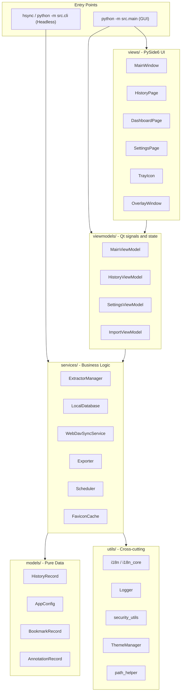

# Обзор Архитектуры

HistorySync использует понятную архитектуру **MVVM (Model-View-ViewModel)**. UI и бизнес-логика разделены, поэтому одни и те же ключевые компоненты работают и в настольном приложении, и в headless CLI.

---

## Диаграмма Верхнего Уровня



---

## Структура Директорий

```
src/
├── main.py
├── cli.py
├── models/
│   ├── app_config.py
│   └── history_record.py
├── services/
│   ├── local_db.py
│   ├── extractor_manager.py
│   ├── webdav_sync.py
│   ├── exporter.py
│   ├── scheduler.py
│   ├── favicon_cache.py
│   ├── favicon_manager.py
│   ├── browser_monitor.py
│   ├── browser_scanner.py
│   ├── db_importer.py
│   ├── migration_service.py
│   ├── mock_data_generator.py
│   └── extractors/
│       ├── base_extractor.py
│       ├── chromium_extractor.py
│       ├── firefox_extractor.py
│       ├── safari_extractor.py
│       └── favicon_extractor.py
├── viewmodels/
│   ├── main_viewmodel.py
│   ├── history_viewmodel.py
│   ├── settings_viewmodel.py
│   └── import_viewmodel.py
├── views/
│   ├── main_window.py
│   ├── history_page.py
│   ├── dashboard_page.py
│   ├── stats_page.py
│   ├── bookmarks_page.py
│   ├── settings_page.py
│   ├── overlay_window.py
│   ├── tray_icon.py
│   ├── export_dialog.py
│   └── import_dialog.py
└── utils/
    ├── constants.py
    ├── i18n.py
    ├── i18n_core.py
    ├── logger.py
    ├── path_helper.py
    ├── security_utils.py
    ├── search_parser.py
    ├── search_highlighter.py
    ├── single_instance.py
    ├── theme_manager.py
    └── font_manager.py
```

В список включены только реальные основные модули. Это снижает риск устаревания документации из-за второстепенных файлов, которые часто меняются.

---

## Ключевые Компоненты

### AppConfig

`src/models/app_config.py` хранит всю пользовательскую конфигурацию. Вложенные секции сериализуются в JSON, а при повреждении конфигурации выполняются резервное копирование и восстановление по умолчанию.

Важно:
- поля времени выполнения вроде `_fresh` и `_load_error` не сохраняются;
- пароли WebDAV шифруются при записи и расшифровываются при загрузке;
- режим `--fresh` всегда работает во временной директории и не трогает реальные пользовательские данные.

### LocalDatabase

`src/services/local_db.py` — это обёртка над SQLite, отвечающая за:
- полнотекстовый поиск FTS5;
- пагинацию и запросы на больших объёмах данных;
- upsert/дедупликацию по `(browser_type, url, visit_time)`;
- закладки, аннотации, скрытые записи и данные устройств.

### ExtractorManager и extractors

`src/services/extractor_manager.py` координирует обнаружение браузеров и поток извлечения данных. Реальные реализации находятся в `src/services/extractors/`.

Важно:
- extractors для Chromium и Firefox используют WAL snapshots для чтения открытых браузерных БД;
- extractor Safari обрабатывает формат истории macOS;
- поддержка нового браузера того же семейства часто сводится к расширению существующего extractor.

### Слой ViewModel

Текущий слой ViewModel небольшой и напрямую соответствует коду:
- `MainViewModel` координирует sync, backup, scheduler, tray и overlay;
- `HistoryViewModel` управляет состоянием поиска, пагинацией и виртуализированной выдачей;
- `SettingsViewModel` отдаёт UI сохранение настроек и действия обслуживания;
- `ImportViewModel` отвечает за импорт внешних БД.

### Разделение i18n

Локализация разделена на два уровня:
- `src/utils/i18n_core.py` для CLI, services и models;
- `src/utils/i18n.py` для Qt-моста на стороне UI.

Это позволяет headless-режиму не зависеть от Qt, а GUI — корректно реагировать на переключение языка.

---

## Модель Потоков

| Поток | Ответственность |
|---|---|
| Qt main thread | рендеринг UI и обработка сигналов |
| Scheduler thread | периодические триггеры sync / backup |
| Worker threads | I/O extractors, загрузки WebDAV, обслуживание |
| pynput thread | слежение за глобальными hotkeys |
| Favicon thread | загрузка и кэширование favicon |

Основной механизм межпоточного взаимодействия — Qt signals / slots.

---

## Принципы Проектирования

1. **services не зависят от Qt**, чтобы одна и та же логика работала и в GUI, и в CLI.
2. **файловые операции атомарны**, чтобы избежать частично записанной конфигурации или резервных копий.
3. **конфиденциальность включена по умолчанию**, внутренние URL браузеров и заблокированные домены фильтруются автоматически.
4. **мягкая деградация**, приложение по возможности продолжает работать даже при повреждённой конфигурации или сбое удалённого backup.
```

---

## Модель Потоков

| Поток | Ответственность |
|---|---|
| **Основной поток Qt** | Рендеринг UI, диспетчеризация сигналов |
| **Поток планировщика** | Периодические триггеры синхронизации/резервного копирования |
| **Рабочие потоки** | Файловый ввод/вывод экстракторов, загрузки WebDAV (Qt `QThreadPool`) |
| **Поток pynput** | Слушатель глобальных горячих клавиш |
| **Поток иконок** | Асинхронная загрузка и кэширование иконок |

Всё межпоточное взаимодействие использует сигналы/слоты Qt — фоновые потоки испускают сигналы; основной поток их обрабатывает.

---

## Принципы Проектирования

1. **Сервисы не имеют зависимостей от Qt** — они могут использоваться из CLI без интерфейса без `QApplication`.
2. **Атомарные операции с файлами** — сохранения конфигурации и загрузки WebDAV используют паттерн temp-file-then-rename для предотвращения частичных записей.
3. **Приватность по умолчанию** — URL вида `chrome://`, `about:`, `file://` и расширения браузеров фильтруются автоматически.
4. **Мягкая деградация** — повреждённая конфигурация резервируется и заменяется значениями по умолчанию; приложение продолжает работу.
