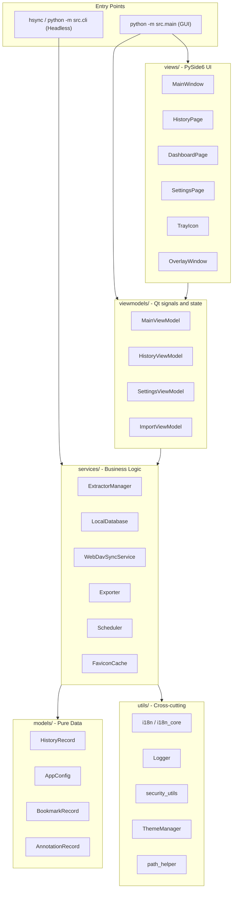

# 架構概覽

HistorySync 採用清楚的 **MVVM（Model-View-ViewModel）** 架構。GUI 程式碼與業務邏輯嚴格分離，因此同一套核心能力既能驅動桌面應用，也能驅動無頭 CLI。

---

## 高層架構圖



---

## 目錄結構

```
src/
├── main.py
├── cli.py
├── models/
│   ├── app_config.py
│   └── history_record.py
├── services/
│   ├── local_db.py
│   ├── extractor_manager.py
│   ├── webdav_sync.py
│   ├── exporter.py
│   ├── scheduler.py
│   ├── favicon_cache.py
│   ├── favicon_manager.py
│   ├── browser_monitor.py
│   ├── browser_scanner.py
│   ├── db_importer.py
│   ├── migration_service.py
│   ├── mock_data_generator.py
│   └── extractors/
│       ├── base_extractor.py
│       ├── chromium_extractor.py
│       ├── firefox_extractor.py
│       ├── safari_extractor.py
│       └── favicon_extractor.py
├── viewmodels/
│   ├── main_viewmodel.py
│   ├── history_viewmodel.py
│   ├── settings_viewmodel.py
│   └── import_viewmodel.py
├── views/
│   ├── main_window.py
│   ├── history_page.py
│   ├── dashboard_page.py
│   ├── stats_page.py
│   ├── bookmarks_page.py
│   ├── settings_page.py
│   ├── overlay_window.py
│   ├── tray_icon.py
│   ├── export_dialog.py
│   └── import_dialog.py
└── utils/
    ├── constants.py
    ├── i18n.py
    ├── i18n_core.py
    ├── logger.py
    ├── path_helper.py
    ├── security_utils.py
    ├── search_parser.py
    ├── search_highlighter.py
    ├── single_instance.py
    ├── theme_manager.py
    └── font_manager.py
```

上面的目錄樹刻意只列出核心模組，避免把容易漂移的次要頁面和輔助檔案硬編碼進文件。

---

## 關鍵元件

### AppConfig

`src/models/app_config.py` 持有所有使用者設定。巢狀子設定直接映射到 JSON，並在載入損毀設定時自動回退並備份。

關鍵點：
- `_fresh`、`_load_error` 等執行時欄位不會持久化。
- WebDAV 密碼在儲存時加密，在載入時解密。
- `--fresh` 模式始終使用暫存目錄，不碰觸真實使用者資料。

### LocalDatabase

`src/services/local_db.py` 是本機 SQLite 封裝層，負責：
- FTS5 全文搜尋。
- 大資料量下的分頁與查詢。
- 以 `(browser_type, url, visit_time)` 為鍵的 upsert 去重。
- 書籤、批註、隱藏紀錄與裝置資料等附加儲存。

### ExtractorManager 與擷取器

`src/services/extractor_manager.py` 負責發現瀏覽器並協調擷取流程。實際擷取邏輯位於 `src/services/extractors/` 之下的具體實作中。

關鍵點：
- Chromium 與 Firefox 擷取器都使用 WAL 快照讀取正在執行的瀏覽器資料庫。
- Safari 擷取器處理 macOS 平台上的 Safari 歷史資料。
- 新增同系瀏覽器時，通常只需要在既有擷取器模型上擴充路徑與中繼資料。

### ViewModel 層

目前 ViewModel 層保持精簡，並直接對應真實實作：
- `MainViewModel` 協調同步、備份、排程器、系統匣與覆蓋層。
- `HistoryViewModel` 管理搜尋狀態、分頁與虛擬清單載入。
- `SettingsViewModel` 暴露設定儲存與維護操作。
- `ImportViewModel` 驅動外部資料庫匯入流程。

### i18n 分層

本專案把本地化拆成兩層：
- `src/utils/i18n_core.py` 供 CLI、services 與 models 使用。
- `src/utils/i18n.py` 在此基礎上增加 Qt 橋接，供 UI 使用。

這樣可以保證無頭模式不依賴 Qt，同時 GUI 仍能回應語言切換。

---

## 執行緒模型

| 執行緒 | 職責 |
|---|---|
| Qt 主執行緒 | UI 渲染與訊號分發 |
| 排程器執行緒 | 定期同步與備份觸發 |
| 工作執行緒 | 擷取器 I/O、WebDAV 上傳、維護任務 |
| pynput 執行緒 | 全域熱鍵監聽 |
| 圖示執行緒 | 網站圖示下載與快取 |

跨執行緒通訊主要透過 Qt 訊號/槽完成。

---

## 設計原則

1. **Service 層零 Qt 相依**，確保 CLI 和無頭模式可重用核心邏輯。
2. **原子化檔案操作**，避免設定與備份寫出半成品。
3. **隱私預設開啟**，內部瀏覽器 URL 與黑名單網域會被過濾。
4. **優雅降級**，設定損毀、搜尋索引異常或遠端備份失敗時，應用會盡量繼續運作。
