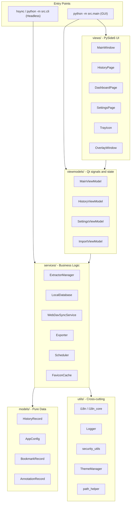

# 架构概览

HistorySync 采用清晰的 **MVVM（Model-View-ViewModel）** 架构。GUI 代码与业务逻辑严格分离，因此同一套核心能力既能驱动桌面应用，也能驱动无头 CLI。

---

## 高层架构图



---

## 目录结构

```
src/
├── main.py
├── cli.py
├── models/
│   ├── app_config.py
│   └── history_record.py
├── services/
│   ├── local_db.py
│   ├── extractor_manager.py
│   ├── webdav_sync.py
│   ├── exporter.py
│   ├── scheduler.py
│   ├── favicon_cache.py
│   ├── favicon_manager.py
│   ├── browser_monitor.py
│   ├── browser_scanner.py
│   ├── db_importer.py
│   ├── migration_service.py
│   ├── mock_data_generator.py
│   └── extractors/
│       ├── base_extractor.py
│       ├── chromium_extractor.py
│       ├── firefox_extractor.py
│       ├── safari_extractor.py
│       └── favicon_extractor.py
├── viewmodels/
│   ├── main_viewmodel.py
│   ├── history_viewmodel.py
│   ├── settings_viewmodel.py
│   └── import_viewmodel.py
├── views/
│   ├── main_window.py
│   ├── history_page.py
│   ├── dashboard_page.py
│   ├── stats_page.py
│   ├── bookmarks_page.py
│   ├── settings_page.py
│   ├── overlay_window.py
│   ├── tray_icon.py
│   ├── export_dialog.py
│   └── import_dialog.py
└── utils/
    ├── constants.py
    ├── i18n.py
    ├── i18n_core.py
    ├── logger.py
    ├── path_helper.py
    ├── security_utils.py
    ├── search_parser.py
    ├── search_highlighter.py
    ├── single_instance.py
    ├── theme_manager.py
    └── font_manager.py
```

上面的目录树刻意只列出核心模块，避免把容易漂移的次要页面和辅助文件硬编码进文档。

---

## 关键组件

### AppConfig

`src/models/app_config.py` 持有所有用户配置。嵌套子配置直接映射到 JSON，并在加载损坏配置时自动回退并备份。

关键点：
- `_fresh`、`_load_error` 等运行时字段不会持久化。
- WebDAV 密码在保存时加密，在加载时解密。
- `--fresh` 模式始终使用临时目录，不触碰真实用户数据。

### LocalDatabase

`src/services/local_db.py` 是本地 SQLite 封装层，负责：
- FTS5 全文搜索。
- 大数据量下的分页与查询。
- 以 `(browser_type, url, visit_time)` 为键的 upsert 去重。
- 书签、批注、隐藏记录和设备数据等附加存储。

### ExtractorManager 与提取器

`src/services/extractor_manager.py` 负责发现浏览器并协调提取流程。实际提取逻辑位于 `src/services/extractors/` 下的具体实现中。

关键点：
- Chromium 和 Firefox 提取器都使用 WAL 快照读取正在运行的浏览器数据库。
- Safari 提取器处理 macOS 平台的 Safari 历史数据。
- 新增同系浏览器时，通常只需要在现有提取器模型上扩展路径和元数据。

### ViewModel 层

当前 ViewModel 层保持精简，并直接对应真实实现：
- `MainViewModel` 协调同步、备份、调度器、托盘和覆盖层。
- `HistoryViewModel` 管理搜索状态、分页和虚拟列表加载。
- `SettingsViewModel` 暴露配置保存和维护操作。
- `ImportViewModel` 驱动外部数据库导入流程。

### i18n 分层

本项目把本地化拆成两层：
- `src/utils/i18n_core.py` 供 CLI、services 和 models 使用。
- `src/utils/i18n.py` 在此基础上增加 Qt 桥接，供 UI 使用。

这样可以保证无头模式不依赖 Qt，同时 GUI 仍能响应语言切换。

---

## 线程模型

| 线程 | 职责 |
|---|---|
| Qt 主线程 | UI 渲染与信号分发 |
| 调度器线程 | 定期同步与备份触发 |
| 工作线程 | 提取器 I/O、WebDAV 上传、维护任务 |
| pynput 线程 | 全局热键监听 |
| 图标线程 | 网站图标下载与缓存 |

跨线程通信主要通过 Qt 信号/槽完成。

---

## 设计原则

1. **Service 层零 Qt 依赖**，保证 CLI 和无头模式可复用核心逻辑。
2. **原子化文件操作**，避免配置和备份写入半成品。
3. **隐私默认开启**，内部浏览器 URL 和黑名单域名会被过滤。
4. **优雅降级**，配置损坏、搜索索引异常或远程备份失败时，应用尽量继续运行。
